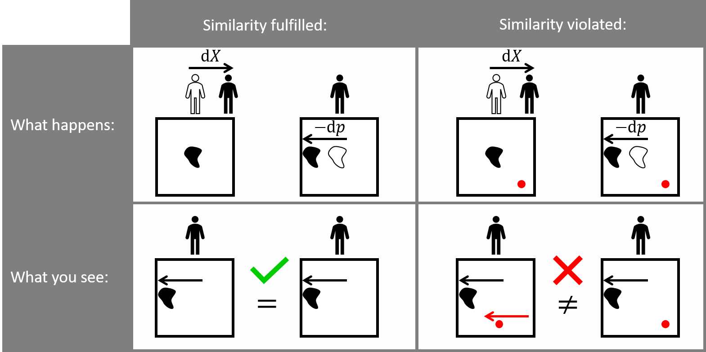

Configurational forces
======================

Derivation of configurational forces
------------------------------------

Configurational body forces
:math:`(\vec{g}_{\textrm{body}})_{i}=g_{\textrm{body},i}`
for a hyper-elastic material are defined as [1]_:

.. math::
    :label: eq_1

    g_{\textrm{body},i}
    :=
    - \left( \frac{\partial \Psi}{\partial X_{i}} \right)_{\textbf{F}}
    - \left( F^{\top} \right)_{ij} \cdot B_{j}

.. note::

    The large displacement framework is used in this formulation of configurational forces.
    This has to be considered in Abaqus simulations
    by setting the flag **NLGEOM=ON** in order to compute the Cauchy stresses correctly.

The partial derivative of the Helmholtz energy density
:math:`\Psi` with respect to the undeformed coordinates
:math:`(\vec{X})_{i} = X_{i}` is evaluated under a constant deformation gradient
:math:`(\textbf{F})_{ij} = F_{ij}`.
This partial derivative is often called “internal configurational body forces”.
The next term
:math:`\left( F^{\top} \right)_{ij} \cdot B_{j}` contains body forces
:math:`(\vec{B})_{j} = B_{j}` and is often called “external configurational body forces”.
Note, that
:math:`\vec{B}(\vec{X})` is defined on the undeformed configuration.
Equation :eq:`eq_1` cannot be computed easily, because the partial derivative is unknown.
An alternative computation approach is shown in the following.
For this we start with the Helmholtz energy density for a hyper-elastic material

.. math::
    :label: eq_2

    \Psi
    =
    \Psi \left( \vec{X}, \textbf{F} \left( \vec{X} \right) \right)
    \; ,

that depends on the undeformed coordinates
:math:`\vec{X}` and the deformation gradient
:math:`\textbf{F}`.
In this case the Helmholtz energy density
:math:`\Psi` is just the strain energy density.
Next, we derive the Helmholtz energy density by
:math:`\vec{X}` using the chain rule.

.. math::
    :label: eq_3

    \frac{\textrm{d} \Psi}{\textrm{d} X_{i}}
    =
    \left( \frac{\partial \Psi}{\partial X_{i}} \right)_{\textbf{F}}
    +
    \left( \frac{\partial \Psi}{\partial F_{jk}} \right)_{\vec{X}}
    \cdot
    \frac{\textrm{d} F_{jk}}{\textrm{d} X_{i}}

Note that
:math:`\textrm{d} \Psi / \textrm{d} X_{i}` and
:math:`\textrm{d} F_{jk} / \textrm{d} X_{i}`
can be computed easily.

Piola-Kirchhoff stress
**********************

Furthermore, from FEM simulation we get the first Piola-Kirchhoff stress
:math:`(\textbf{P})_{ij} = P_{ij}`.
For an elastic material in the large deformation framework, the first Piola-Kirchhoff stress

.. math::
    :label: eq_4

    P_{ij}
    =
    \left( \frac{\partial \Psi}{\partial F_{jk}} \right)_{\vec{X}}

corresponds to the partial derivative of the Helmholtz energy density
:math:`\Psi` with respect to the deformation gradient
:math:`\textbf{F}` at a fixed position
:math:`\vec{X}`. [2]_

Inserting equation :eq:`eq_4` into equation :eq:`eq_3` yields

.. math::
    :label: eq_5

    \frac{\textrm{d} \Psi}{\textrm{d} X_{i}}
    =
    \left( \frac{\partial \Psi}{\partial X_{i}} \right)_{\textbf{F}}
    +
    P_{jk}
    \cdot
    \frac{\textrm{d} F_{jk}}{\textrm{d} X_{i}}
    \; .

Index swap of deformation gradient
**********************************

The deformation gradient

.. math::
    :label: eq_6

    F_{jk}
    :=
    \frac{\textrm{d} x_{j}}{\textrm{d} X_{k}}

is defined as the derivative of the deformed coordinates
:math:`(\vec{x})_{i} = x_{i} = X_{i} + U_{i}`
with respect to the undeformed coordinates
:math:`\vec{X}`.
This allows to swap the indices in the following equation

.. math::
    :label: eq_7

    \frac{\textrm{d} F_{jk}}{\textrm{d} X_{i}}
    =
    \frac{\textrm{d} }{\textrm{d} X_{i}}
    \frac{\textrm{d} x_{j}}{\textrm{d} X_{k}}
    =
    \frac{\textrm{d}^{2} x_{j} }{\textrm{d} X_{i} \; \textrm{d} X_{k}}
    =
    \frac{\textrm{d}^{2} x_{j} }{\textrm{d} X_{k} \; \textrm{d} X_{i}}
    =
    \frac{\textrm{d} }{\textrm{d} X_{k}}
    \frac{\textrm{d} x_{j}}{\textrm{d} X_{i}}
    =
    \frac{\textrm{d} F_{ji}}{\textrm{d} X_{k}}
    \; .

Inserting this in equation :eq:`eq_5` yields

.. math::
    :label: eq_8

    \frac{\textrm{d} \Psi}{\textrm{d} X_{i}}
    =
    \left( \frac{\partial \Psi}{\partial X_{i}} \right)_{\textbf{F}}
    +
    P_{jk}
    \cdot
    \frac{\textrm{d} F_{ji}}{\textrm{d} X_{k}}
    \; .

Product rule for derivative
***************************

For scalar functions :math:`f` and :math:`g`,
the product rule is well known as
:math:`(fg)'=f'g+fg'`.
For the product of two tensors
:math:`\textbf{F}` and :math:`\textbf{P}` the product rule is [3]_:

.. math::
    :label: eq_9

    \frac{
        \textrm{d} \left(
            \left( F^{\top} \right)_{ij}
            \cdot P_{jk}
        \right)
    }{
        \textrm{d} X_{k}
    }
    =
    \left( F^{\top} \right)_{ij}
    \cdot
    \frac{\textrm{d} P_{jk} }{ \textrm{d} X_{k} }
    +
    P_{jk}
    \cdot
    \frac{\textrm{d} F_{ji} }{ \textrm{d} X_{k} }

Note that the last term exists in equation :eq:`eq_8`.
Pull out this term:

.. math::
    :label: eq_10

    P_{jk}
    \cdot
    \frac{\textrm{d} F_{ji} }{ \textrm{d} X_{k} }
    =
    \frac{
        \textrm{d} \left(
            \left( F^{\top} \right)_{ij}
            \cdot P_{jk}
        \right)
    }{
        \textrm{d} X_{k}
    }
    -
    \left( F^{\top} \right)_{ij}
    \cdot
    \frac{\textrm{d} P_{jk} }{ \textrm{d} X_{k} }

And insert it into equation :eq:`eq_8`.

.. math::
    :label: eq_11

    \frac{\textrm{d} \Psi}{\textrm{d} X_{i}}
    =
    \left( \frac{\partial \Psi}{\partial X_{i}} \right)_{\textbf{F}}
    +
        \frac{
        \textrm{d} \left(
            \left( F^{\top} \right)_{ij}
            \cdot P_{jk}
        \right)
    }{
        \textrm{d} X_{k}
    }
    -
    \left( F^{\top} \right)_{ij}
    \cdot
    \frac{\textrm{d} P_{jk} }{ \textrm{d} X_{k} }

Body forces
***********

The sum of all forces is zero.
This is called the equilibrium of forces.
For the static case this equilibrium is [2]_:

.. math::
    :label: eq_12

    B_{j}
    =
    - \frac{\textrm{d} P_{jk}}{\textrm{d} X_{k}}

The body forces
:math:`\vec{B}` correspond to the divergence of the first Piola-Kirchhoff stress
:math:`\textbf{P}`.
Inserting this into equation :eq:`eq_11` yields

.. math::
    :label: eq_13

    \frac{\textrm{d} \Psi}{\textrm{d} X_{i}}
    =
    \left( \frac{\partial \Psi}{\partial X_{i}} \right)_{\textbf{F}}
    +
        \frac{
        \textrm{d} \left(
            \left( F^{\top} \right)_{ij}
            \cdot P_{jk}
        \right)
    }{
        \textrm{d} X_{k}
    }
    +
    \left( F^{\top} \right)_{ij}
    \cdot
    B_{j}
    \; .

Configurational forces
**********************

We can rearrange equation :eq:`eq_13`

.. math::
    :label: eq_14

    \frac{\textrm{d} \Psi}{\textrm{d} X_{i}}
    -
    \frac{
        \textrm{d} \left(
            \left( F^{\top} \right)_{ij}
            \cdot P_{jk}
        \right)
    }{
        \textrm{d} X_{k}
    }
    =
    \left( \frac{\partial \Psi}{\partial X_{i}} \right)_{\textbf{F}}
    +
    \left( F^{\top} \right)_{ij}
    \cdot
    B_{j}

and compare the right side to the definition of configurational body forces in equation :eq:`eq_1`.

.. math::
    :label: eq_15

    \frac{\textrm{d} \Psi}{\textrm{d} X_{i}}
    -
    \frac{
        \textrm{d} \left(
            \left( F^{\top} \right)_{ij}
            \cdot P_{jk}
        \right)
    }{
        \textrm{d} X_{k}
    }
    =
    -g_{\textrm{body}, i}

This equation contains only total derivatives of the Helmholtz energy density
:math:`\Psi`, the deformation gradient
:math:`\textbf{F}` and the first Piola-Kirchhoff stress
:math:`\textbf{P}`.
These quantities can be computed from FEM results.

Prettify
********

Equation :eq:`eq_15` can already be used.
However, it is common to rearrange the equation into a more beautiful form with only one total derivative.
For this, the derivative of the Helmholtz energy density is written as

.. math::
    :label: eq_16

    \frac{\textrm{d} \Psi}{\textrm{d} X_{i}}
    =
    \frac{\textrm{d} \Psi}{\textrm{d} X_{k}}
    \cdot
    \frac{\textrm{d} X_{k}}{\textrm{d} X_{i}}
    =
    \frac{\textrm{d} \Psi}{\textrm{d} X_{k}}
    \cdot
    \delta_{ik}
    =
    \frac{\textrm{d} \Psi \cdot \delta_{ik}}{\textrm{d} X_{k}}
    \; .

Insert this into equation :eq:`eq_15`.

.. math::
    :label: eq_17

    \frac{
        \textrm{d} \left(
            \Psi \cdot \delta_{ik}
            -
            \left( F^{\top} \right)_{ij}
            \cdot
            P_{jk}
        \right)
    }{\textrm{d} X_{k}}
    =
    -g_{\textrm{body}, i}

Furthermore, Eshelby introduces the configurational stress (or energy momentum) tensor
:math:`(\textbf{CS})_{ik} = CS_{ik}` [4]_:

.. math::
    :label: eq_18

    CS_{ik}
    =
    \Psi \cdot \delta_{ik}
    -
    \left( F^{\top} \right)_{ij}
    \cdot
    P_{jk}

Using the configurational stress tensor, equation :eq:`eq_17` is simplified to:

.. math::
    :label: eq_19

    \frac{ \textrm{d} CS_{ik} }{\textrm{d}  X_{k}}
    =
    -g_{\textrm{body}, i}

Nodal configurational forces
****************************

For the computation of configurational forces from FEM results, it is common to compute nodal configurational forces.
Each node is associated with a node volume by integrating the shape function of the i-th node
:math:`\int_{\mathcal{B}} H_{i}(\vec{X})\, \textrm{d}V`.
The sum of the node volumes is exactly the volume
:math:`V=\int_{\mathcal{B}}1\,\textrm{d}V` of the whole body :math:`\mathcal{B}`,
because the sum of the shape functions is
:math:`\sum_{i}H_{i}(\vec{X})=1` at every position :math:`\vec{X}`.
The same idea as used for the volume integral is also used for the nodal configurational forces.
They are just weighted by the shape functions
:math:`(\vec{H})_{i} = H_{i}` and are computed for each node.
This is all done by our software.
The nodal configurational force for the i-th node is [1]_:

.. math::
    :label: eq_20

    g_{\textrm{nodal},ij}
    =
    \int_{\mathcal{B}}
    g_{\textrm{body},i}
    \cdot
    H_{j}
    \,\textrm{d}V

This can be written as:

.. math::
    :label: eq_21

    g_{\textrm{nodal},ij}
    =
    \int_{\mathcal{B}}
    -\frac{ \textrm{d} CS_{ik} }{\textrm{d}  X_{k}}
    \cdot
    H_{j}
    \,\textrm{d}V

Integration by parts using Greens identity leads to:

.. math::
    :label: eq_22

    g_{\textrm{nodal},ij}
    =
    -\int_{\mathcal{\partial B}}
    CS_{ik}
    \cdot
    N_{k}
    \cdot
    H_{j}
    \,\textrm{d}A
    +
    \int_{\mathcal{B}}
    CS_{ik}
    \cdot
    \frac{ \textrm{d} H_{j} }{\textrm{d}  X_{k}}
    \,\textrm{d}V

With the normal vector
:math:`(\vec{N})_{k}=N_{k}` that points normal to the boundary
:math:`\partial \mathcal{B}` to the outside of the body
:math:`\mathcal{B}`.
Since the shape functions
:math:`\vec{H}(\vec{X})` are continuous analytical functions defined on the whole body
:math:`\mathcal{B}`, it is easier to derive them instead of the configurational stresses
:math:`\mathbf{CS}`,  that are computed only at the integration points.
Furthermore, the surface integral is zero, if the shape functions are all zero at the boundary.
In this case the equation can be simplified to:

.. math::
    :label: eq_23

    g_{\textrm{nodal},ij}
    =
    \int_{\mathcal{B}}
    CS_{ik}
    \cdot
    \frac{ \textrm{d} H_{j} }{\textrm{d}  X_{k}}
    \,\textrm{d}V

This integral is evaluated using the Gaussian integration that is commonly used in FEM.
Our software conforce computes this integral and neglects the surface integral.
Note, that neglecting the surface integral is not valid, for nodes lying at the boundary.

Displacement-based formulation
******************************

The displacement-based formulation (dbf) of the configurational forces replaces the deformation gradient
:math:`\textbf{F}` by the gradient of the displacements
:math:`(\vec{U})_{i} = U_{i}`.

Consequently, the dbf configurational stress is defined as [3]_:

.. math::
    :label: eq_24

    CS_{\textrm{dbf}, ik}
    =
    \Psi \cdot \delta_{ik}
    -
    \frac{ \textrm{d} U_{j} }{\textrm{d}  X_{i}}
    \cdot
    P_{jk}

Note, that there is a dependency between the deformation gradient
:math:`\textbf{F}` and the displacement gradient:

.. math::
    :label: eq_25

    F_{ik}
    :=
    \frac{\textrm{d} x_{i}}{\textrm{d} X_{k}}
    =
    \delta_{ik}
    +
    \frac{\textrm{d} U_{i}}{\textrm{d} X_{k}}

An argument for dbf is, that it is numerically more stable for small displacements.
Let’s for example consider a displacement gradient of
:math:`1 \cdot 10^{-7}`.
The deformation gradient adds one to this small numbers
:math:`1 + 1 \cdot 10^{-7} = 1.0000001`.
The computer might round this number to 1.
Consequently, you remain more significant digits by using the displacement gradient instead of the deformation gradient.

The configurational stress
:math:`\textbf{CS}` is the dbf configurational stress
:math:`\textbf{CS}_{\textrm{dbf}}` minus the first Piola-Kirchhoff stress
:math:`\mathbf{P}`.

.. math::
    :label: eq_26

    \begin{eqnarray}
        CS_{ik} & = &
            \Psi \cdot \delta_{ik}
            - \left(
                \delta_{ij}
                + \frac{\textrm{d} U_{j}}{\textrm{d} X_{i}}
            \right) \cdot P_{jk}
        \\
        & = &
            \Psi \cdot \delta_{ik}
            - P_{ik}
            - \frac{\textrm{d} U_{j}}{\textrm{d} X_{i}} \cdot P_{jk}
        \\
        & = &
        CS_{\textrm{dbf}, ik} - P_{ik}
    \end{eqnarray}

In the absence of body forces
:math:`\vec{B}`, the configurational body force
:math:`\vec{g}_{\textrm{body}}` corresponds to the dbf configurational body force
:math:`\vec{g}_{\textrm{body, dbf}}`.

.. math::
    :label: eq_27

    \begin{eqnarray}
        g_{\textrm{body}, i} & = &
            - \frac{\textrm{d} CS_{ik}}{\textrm{d} X_{k}}
        \\
        & = &
            - \frac{\textrm{d} (CS_{\textrm{dbf}, ik} - P_{ik})}{\textrm{d} X_{k}}
        \\
        & = &
            - \frac{\textrm{d} CS_{\textrm{dbf}, ik} }{\textrm{d} X_{k}}
            + \frac{\textrm{d} P_{ik} }{\textrm{d} X_{k}}
        \\
        & = &
            - \frac{\textrm{d} CS_{\textrm{dbf}, ik} }{\textrm{d} X_{k}}
            - B_{i}
        \\
        & = &
        g_{\textrm{body,dbf}, i} - B_{i}
    \end{eqnarray}

The nodal configurational forces can be converted using the following equation.

.. math::
    :label: eq_28

    \begin{eqnarray}
        g_{\textrm{nodal}, ij} & = &
            \int_{\mathcal{B}} g_{\textrm{body}, i} \cdot H_{j} \,\textrm{d}V
        \\
        & = &
            \int_{\mathcal{B}} g_{\textrm{body, dbf}, i} \cdot H_{j} \,\textrm{d}V
            - \int_{\mathcal{B}} B_{i} \cdot H_{j} \,\textrm{d}V
        \\
        & = &
        g_{\textrm{nodal,dbf}, ij} - B_{\textrm{nodal},ij}
    \end{eqnarray}

Configurational forces in facture mechanics
-------------------------------------------

Configurational forces are used to estimate the energy gradient with respect to a change in geometry.
We call this gradient the energy release rate :math:`G=\partial \Pi / \partial \vec{p}`.
The geometry change might be a movement of the crack tip position :math:`\vec{p}`.
However, the definition of configurational forces in equation :eq:`eq_1`
does not derive by the crack tip position :math:`\vec{p}` but derives by a coordinate :math:`\vec{X}`.
This is not the same, as the following example illustrates.
:ref:`Figure 1 <theory_images_similarity>` provides a graphical explanation.

Imagine you stand at a position :math:`\vec{X}` and look at a point :math:`\vec{p}`.
You can either move this point by :math:`\partial \vec{p}`
or you can move yourself by :math:`-\partial \vec{X}`.
From your point of view, the point would look the same in both cases and you might guess that
:math:`\partial \vec{p} = -\partial \vec{X}`.
However, you also see the surrounding of the point. There are two cases:

#. In the first case, a second point :math:`\partial \vec{p'}`
   lies in the surrounding of point :math:`\partial \vec{p}`.
   :ref:`Figure 1 <theory_images_similarity>` depicts the second point as red circle.
   If you move yourself by :math:`-\partial \vec{X}`,
   point :math:`\vec{p'}` moves in common with point :math:`\vec{p}` from your point of view.
   If you stand still and move point :math:`\vec{p}` by :math:`\partial \vec{p}` instead,
   the other point :math:`\vec{p'}` stays fixed.
   Consequently, you can distinguish between a change of the point position and a change of the coordinates
   :math:`\partial \vec{p} \neq -\partial \vec{X}`.
#. In the second case, there is no other significant point in the surrounding of point :math:`\vec{p'}`.
   Consequently, :math:`\partial \vec{p} = -\partial \vec{X}` holds true. We call this similarity.

.. _theory_images_similarity:

    Figure 1: Similarity of :math:`\textrm{d}X` and :math:`-\textrm{d}p`

Configurational forces are a valid estimation of the energy release rate
:math:`G` only in the second case.
The following section explains how :math:`G` is evaluated from the strain energy density
:math:`\Psi` using configurational forces.
For a hyper-elastic material, the strain energy density :math:`\Psi` depends on coordinates
:math:`\vec{X}`, the deformation tensor
:math:`\textbf{F}(\vec{X})` and geometrical measures like the position of the crack tip
:math:`\vec{p}`.
In the absence of inertia and body forces like gravity
:math:`\vec{B}=\vec{0}`, configurational body forces are gradients of
:math:`\Psi` with respect to coordinates
:math:`\vec{X}`, but with a fixed deformation gradient
:math:`\textbf{F}` and a fixed position of the crack tip
:math:`\vec{p}`.

.. math::
    :label: eq_29

    \vec{g}_{\textrm{body}}\left( \vec{X}, \textbf{F}, \vec{p} \right)
    =
    - \left(
        \frac{
            \partial \Psi\left( \vec{X}, \textbf{F}, \vec{p} \right)
        }{
            \partial \vec{X}
        }
    \right)_{ \textbf{F}, \vec{p} }

According to a similarity principle, the derivative by
:math:`\partial \vec{X}` can be replaced by the negative derivative by the position of the crack tip
:math:`-\partial \vec{p}`.

.. math::
    :label: eq_30

    \vec{g}_{\textrm{body}}\left( \vec{X}, \textbf{F}, \vec{p} \right)
    =
    \left(
        \frac{
            \partial \Psi\left( \vec{X}, \textbf{F}, \vec{p} \right)
        }{
            \partial \vec{p}
        }
    \right)_{ \vec{X}, \textbf{F}}

In fracture mechanics, the strain energy
:math:`\Pi` is investigated instead of the energy density
:math:`\Psi`.
The strain energy is the integral over the energy density
:math:`\Pi = \int \Psi \,\textrm{d}V`.
Consequently, integrating the configurational body force over a certain crack-dominated region
:math:`\mathcal{B}` corresponds to the derivative of the strain energy.

.. math::
    :label: eq_31

    \left(
        \frac{
            \partial \Pi \left( \mathcal{B}, \mathbf{F}, \vec{p} \right)
        }{
            \partial \vec{p}
        }
    \right)_{\mathcal{B}, \mathbf{F}}
    =
    \int_{\mathcal{B}}
    \vec{g}_{\textrm{body}}\left( \vec{X}, \textbf{F}, \vec{p} \right)
    \,\textrm{d}V

Interpret this as a shift of a whole region
:math:`\mathcal{B}` instead of a single point.
Note, that the region
:math:`\mathcal{B}` is fixed and configurational forces have to be zero at the boundary
:math:`\partial \mathcal{B}`.
The gradient can be decomposed into an energy release rate
:math:`G` and a unit vector
:math:`\vec{v}` with length one.
The unit vector corresponds to the direction in which the crack will grow.
This is the direction of the maximum energy dissipation.
The energy release rate :math:`G` can be compared to the fracture energy :math:`G_{c}`
to state whether the crack will grow or not.

.. math::
    :label: eq_32

    G \cdot \vec{v}
    =
    \int_{\mathcal{B}}
    \vec{g}_{\textrm{body}}\left( \vec{X}, \textbf{F}, \vec{p} \right)
    \,\textrm{d}V

In FEM, the evaluation of the integral can be simplified by using nodal configurational forces
:math:`\vec{g}_{\textrm{nodal}, i}` instead of the configurational body forces.
In order to compute the energy release rate :math:`G`,
all the user has to do is to call our function and then sum up the nodal configurational forces
in the crack-dominated region and decompose the resulting nodal configurational force
into the energy release rate :math:`G` and the crack growth unit vector :math:`\vec{v}`.

.. math::
    :label: eq_33

    G \cdot \vec{v}
    =
    \sum_{i \in \mathcal{B}}
    \vec{g}_{\textrm{nodal}, i}\left( \textbf{F}, \vec{p} \right)

This demonstrates the advantage of configurational forces compared to the commonly used J-integral.
Configurational forces provide the energy release rate as well as the crack growth direction,
whereas the J-integral [5]_ only provides the energy release rate.

Plasticity
----------

The implemented formulation does **not** support plasticity in general,
since the Helmholtz energy density not only depends on :math:`X` and :math:`F`,
but also on plastic hardening parameters which are not considered here.

However, under the assumption of small strain plasticity,
the formulation has already been used by Kolednik [6]_.
Kolednik proposes two modifications for the configurational stress:

- incremental plasticity, which considers only the elastic strain energy density (SENER)

.. math::

    CS_{\textrm{ep}, ik}
    = \Psi_{\textrm{elastic}} \cdot \delta_{ik}
    - (T^{\top})_{kj} \cdot P_{ij}

- deformation plasticity that considers both elastic and plastic strain energy densities (SENER+PENER)

.. math::

    CS_{\textrm{nlel}, ik}
    = (\Psi_{\textrm{elastic}} + \Psi_{\textrm{plastic}}) \cdot \delta_{ik}
    - (T^{\top})_{kj} \cdot P_{ij}

References
----------

.. [1] R. Mueller and G. A. Maugin,
    “On material forces and finite element discretizations,”
    Computational Mechanics, vol. 29, no. 1, pp. 52–60, Jul. 2002, doi: `10.1007/s00466-002-0322-2 <https://doi.org/10.1007/s00466-002-0322-2>`_.

.. [2] J. S. Bergstrom,
    “Mechanics of Solid Polymers: Theory and Computational Modeling”.
    Elsevier, 2015.

.. [3] M. E. Gurtin,
    Configurational forces as basic concepts of continuum physics.
    in Applied mathematical sciences, no. 137. New York: Springer, 2000.

.. [4] J. D. Eshelby,
    “The force on an elastic singularity,”
    Philosophical Transactions of the Royal Society of London. Series A, Mathematical and Physical Sciences, vol. 244, no. 877, pp. 87–112, 1951.

.. [5] J. R. Rice,
    “A Path Independent Integral and the Approximate Analysis of Strain Concentration by Notches and Cracks,”
    Journal of Applied Mechanics, vol. 35, no. 2, pp. 379–386, Jun. 1968, doi: `10.1115/1.3601206 <https://doi.org/10.1115/1.3601206>`_.

.. [6] O. Kolednik, R. Schöngrundner, and F. D. Fischer,
    “A new view on J-integrals in elastic–plastic materials,”
    Int J Fract, vol. 187, no. 1, pp. 77–107, May 2014, doi: `10.1007/s10704-013-9920-6 <https://doi.org/10.1007/s10704-013-9920-6>`_.
