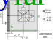

.. _CT_specimen_plastic:

Elastoplastic CT-specimen
===========================

This example uses Configurational Forces to determine the crack driving force. The sum of the CFs over a volume in crack direction represents the well-known J integral [1]_.
The dimensions of the CT-specimen are shown in the subsequent figure.
The model is provided as an Abaqus Input file and an Abaqus cae file and consists of fully-integrated bilinear quadrilateral plane strain elements (CPE4). 

For the partitions F and G, a mapped mesh is used. In area F, the mesh size is 0.15 mm. In area G the mesh size is 0.165 mm on the crack line. 
All other areas are meshed using a free meshing algorithm with a mesh size of 1 mm. 

The specimen is made from an annealed mild steel (S235) with a Young’s modulus of :math:`E_{1}=200\,\mathrm{GPa}`, a Poisson’s ratio of 0.3, yield stress of :math:`\sigma_{y}=270\,\mathrm{MPa}`. 
True stress versus strain curve can be found in the thesis of Schöngrundner [2]_.
Additionally the data for this curve can be found in the Abaqus input file below the :code:`*Plastic` keyword.
The material is modelled using the incremental plasticity model provided by Abaqus. 
Therefore, the plastic behaviour is modelled using 10 measured points of the true stress-strain curve. 
Beyond the ultimate tensile strength of :math:`\sigma_{u}=426\,\mathrm{MPa}`, the material response is linearly extrapolated up to a strain of 300 % and stress of :math:`\sigma_{u}=1460\,\mathrm{MPa}`. 
To avoid large deformations at the load application points, the area around them is modelled with linear elastic material (same Young’s modulus and Poisson’s ratio as the elastoplastic material)

On the :math:`25\,\mathrm{mm}` thick specimen a displacement of :math:`u_{y}=0.5\,\mathrm{mm}` is applied in 10 time steps. 
The presented algorithm, calculates the incremental far-field J-Integral :math:`J_{ep far}=29.58\,\mathrm{mJ/mm^2}` which is in good agreement to :math:`J_{ep far}^{ref}=30.4\,\mathrm{mJ/mm^2}` from Kolednik et al. [3]_.
In contrast to the conventional J-Integral, only the elastic energy density is considered.
The results shown in Fig. 4 are consistent with this work, but it should be noted that there is some influence regarding the mesh size and the element type. 

--------------

This example demonstrates the evaluation of Configurational Forces from an Abaqus output database. Alternatively, the results of the last increment of the FE-calculation are provided within this documentation.
Therefore, the extraction of the FE results is optional.

**Extraction of necessary input data**

The Abaqus Python script :code:`get_Data_from_abq.py` extracts all necessary data from the Abaqus output database. 
Additionally to the :ref:`Two_phase_bar` example, a node set which defines the area where the J-integral is evaluated is exported.
The compiled functions for Configurational Force evaluation are element-dependent, therefore the results have to be extracted on a per-element basis.
In this example, only linear quadrilateral plane-strain elements are used.

The provided script outputs the data in a numpy :code:`.npz` file format. If some results are not available, e.g. plastic strain for a linear elastic calculation, 
an array filled with zeros with the shape described below have to be generated. The same applies for other inputs too, e.g. the stress vector must always be of shape 6, regardless of the calculation.

- Coords
    Numpy nd-array of shape (number of elements, number of nodes per element,3)

- Element Connectivity 
    Numpy nd-array of shape (number of elements, number of nodes per element)

- Displacements
    Numpy nd-array of shape (number of time-steps, number of elements, number of nodes per element,3)

- Stress
    Numpy nd-array of shape (number of time-steps, number of elements, number of integration points per element,6)

- Plastic energy
    Numpy nd-array of shape (number of time-steps, number of elements, number of integration points per element)

- Strain energy
    Numpy nd-array of shape (number of time-steps, number of elements, number of integration points per element)

- Node set
    Numpy nd-array of shape (number of nodes)

**Calculation of Configurational Forces**

In the following step, the script :code:`J_Integral.py` evaluates the configurational forces for all available time steps. The function call :code:`calc_Conf_Force_[Element type]` is element-dependent. 
If there are multiple element types in the model, the corresponding function for each element type has to be called seperately.
First, CFs are calculated at element nodal position. In a subsequent step, nodal unique values can be calculated by calling the function :code:`calc_Nodal`. This function accepts both Numpy nd-arrays
if only one element type is present in the model or a list of Numpy nd-arrays for multiple element types. Note that node labels within the model must be unique. A part/assembly structure is therefore only 
possible if a node label only occurs once in a model. In Abaqus CAE, the option "Do not use parts and assemblies in input files" is recommended to avoid this issue entirely.

    >>> Node_Labels=np.unique(Element_Connectivity)
    >>> # Calculate configurational forces
    >>> CF_Nodal=np.empty((Element_U.shape[0],Node_Labels.shape[0],3))
    >>> for i in range(Element_U.shape[0]):
    >>>     # Calculate on element nodal position
    >>>     CF_Element_Nodal=cf.calc_Conf_Force_CPE4_static(Coords,Element_U[i],S_vec[i],PENER[i]*0.,SENER[i],method='dbf')
    >>>     # Get nodal unique value
    >>>     Node_labels,CF_Nodal[i]=cf.calc_Nodal(Element_Connectivity,CF_Element_Nodal)

**Evaluation of the J-integral**

In this step the configurational forces in crack direction are summed up to calculate the J-integral. 

    >>> #Select the node labels which are in a given node set
    >>> idx=np.isin(Node_labels,eval_Node_Labels,assume_unique=True)
    >>> #Sum configurational forces of all selected nodes
    >>> J_dbf_far = CF_Nodal[:,idx].sum(axis=1)

    >>> #Output the result in x-direction
    >>> print("J_far_ep: "+ str(J_dbf_far[-1,0])+ " mJ/mm^2")

References
----------

.. [1] `Rice JR. A Path Independent Integral and the Approximate Analysis of Strain Concentration by Notches and Cracks. Journal of Applied Mechanics 1968;35(2):379–86. <https://doi.org/10.1115/1.3601206>`_
.. [2] `Ronald Schöngrundner. Numerische Studien zur Ermittlung der risstreibenden Kraft in elastisch-plastischen Materialien bei unterschiedlichen Belastungsbedingungen [Dissertation]. Leoben: Montanuniverstät Leoben; 2010. <https://pure.unileoben.ac.at/portal/de/publications/numerische-studien-zur-ermittlung-der-risstreibenden-kraft-in-elastischplastischen-materialien-bei-unterschiedlichen-belastungsbedingungen(0c6ab65a-3702-4001-87a5-e53456916731).html?customType=theses>`_
.. [3] `Kolednik O, Schöngrundner R, Fischer FD. A new view on J-integrals in elastic–plastic materials. Int J Fract 2014;187(1):77–107. <https://doi.org/10.1007/s10704-013-9920-6>`_